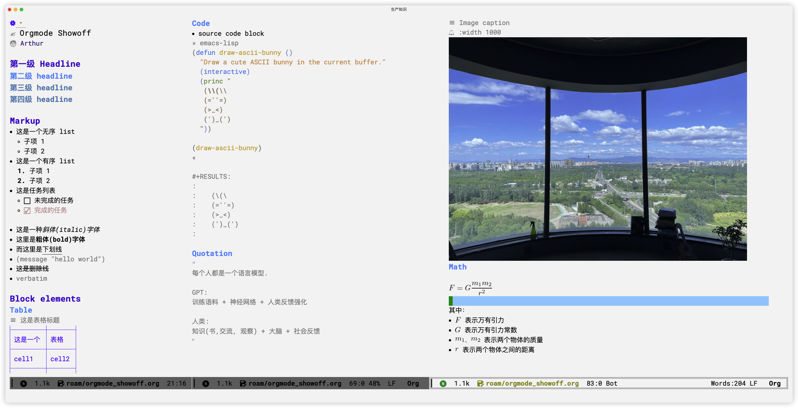
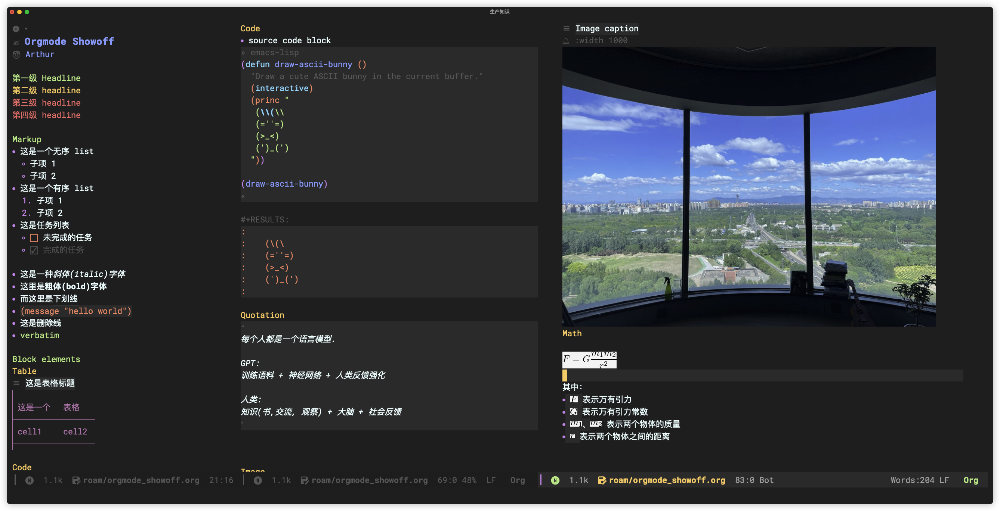

#+title: doom emacs config
#+author: 李继刚

* 原则
#+begin_quote
配置原则： *如无必要, 勿增实体*
#+end_quote

配置的每行代码争取做到 =减无可减= 的状态, 增加的每一行都有其原因。

* 截图
#+attr_org: :width 800px


#+attr_org: :width 800px


* 安装
1. 安装 Doom
   #+begin_src shell
   git clone --depth 1 https://github.com/hlissner/doom-emacs ~/.emacs.d

   ~/.emacs.d/bin/doom install
   #+end_src
2. 下载本配置文件到本地
   #+begin_src shell
    git clone git@github.com:lijigang/emacs.d.git
   #+end_src
3. Tangle 代码生成配置
   #+begin_src
   ;; emacs readme.org
   M-x: org-babel-tangle
   #+end_src

* 配置
** 开关: Doom 自带的模块
:PROPERTIES:
:header-args: :tangle "~/.doom.d/init.el"
:header-args: :mkdirp yes
:END:
#+begin_src emacs-lisp :tangle "~/.doom.d/init.el"
;;; init.el -*- lexical-binding: t; -*-
(doom!
 :completion
 corfu
 (vertico +icons)

 :ui
 doom               ; what makes DOOM look the way it does
 modeline
 hl-todo            ; highlight TODO/FIXME/NOTE/DEPRECATED/HACK/REVIEW
 (ligatures +extra)
 ophints            ; highlight the region an operation acts on
 (popup
  +all
  +defaults)        ; tame sudden yet inevitable temporary windows
 unicode
 zen                ; distraction-free coding or writing

 :editor
 (evil +everywhere) ; come to the dark side, we have cookies
 file-templates     ; auto-snippets for empty files
 fold               ; (nigh) universal code folding
 (format +onsave)   ; automated prettiness
 snippets           ; my elves. They type so I don't have to
 word-wrap

 :emacs
 ;; electric           ; smarter, keyword-based electric-indent
 (ibuffer +icons)   ; interactive buffer management
 undo               ; persistent, smarter undo for your inevitable mistakes

 :checkers
 syntax             ; tasing you for every semicolon you forget

 :tools
 (eval +overlay)    ; run code, run (also, repls)
 lookup             ; navigate your code and its documentation
 magit              ; a git porcelain for Emacs
 pdf                ; pdf enhancements

 :os
 (:if IS-MAC macos) ; improve compatibility with macOS

 :lang
 emacs-lisp         ; drown in parentheses
 latex              ; writing papers in Emacs has never been so fun
 markdown

 (org               ; organize your plain life in plain text
  +dragndrop
  +gnuplot
  +hugo
  +pandoc
  +pretty
  +present)

 plantuml           ; diagrams for confusing people more
 rest               ; for use restclient
 sh                 ; she sells {ba,z,fi}sh shells on the C xor
 yaml               ; JSON, but readable

 :config
 (default +bindings +smartparens))
#+end_src
** 加装: 额外需要的功能包
:PROPERTIES:
:header-args: :tangle "~/.doom.d/packages.el"
:header-args: :mkdirp yes
:END:
#+begin_src emacs-lisp :tangle "~/.doom.d/packages.el"
;;; $DOOMDIR/packages.el --- -*- no-byte-compile: t; -*-

;; 快速跳转到任意位置, 通过汉字拼音的方式
(package! ace-pinyin
  :recipe (:host github :repo "cute-jumper/ace-pinyin"))

(package! denote)
(package! dired-narrow)

(package! consult-notes)
(package! denote-explore)

(package! ef-themes)

;; 导出时支持src block 语法高亮
(package! engrave-faces
  :recipe (:host github :repo "tecosaur/engrave-faces"))

(package! gptel)

(package! imenu-list)

(package! olivetti)

;; 鼠标放到加粗字符上, 可编辑修饰符, 离开即显示加粗后的效果
(package! org-appear
  :recipe (:host github :repo "awth13/org-appear"))

;; 好用的统计字符包
(package! org-count-words
  :recipe (:host github :repo "Elilif/org-count-words"))

;; 在Orgmode 文件中插入图片
(package! org-download)

(package! org-fragtog)
(package! org-imenu
  :recipe (:host github :repo "rougier/org-imenu"))

;; 默认在+pretty 的时候已经包含，需单独关闭
(package! org-modern :disable t)

;; 便捷插入网页到org 文件
(package! org-web-tools)

;; 中英文字符之间自动插入空格, 增加可阅读性
(package! pangu-spacing)

;; 每个标识符显示一个颜色, 花里胡哨的开始
(package! rainbow-identifiers)

(package! rime)

(package! spacious-padding)

(package! superchat
  :recipe (:host github :repo "yibie/superchat"))

(package! ultra-scroll
  :recipe (:host github :repo "jdtsmith/ultra-scroll"))

;; 完美解决中英文字符在表格中对齐的问题
(package! valign)
#+end_src
** 配置: 你想要的效果
:PROPERTIES:
:header-args: :tangle "~/.doom.d/config.el"
:header-args: :mkdirp yes
:END:
*** 通用配置
#+begin_src emacs-lisp :tangle "~/.doom.d/config.el"
;;; $DOOMDIR/config.el -*- lexical-binding: t; -*-

;; Set package archives
(use-package! package
  :config
  (setq package-archives '(("gnu" . "http://elpa.emacs-china.org/gnu/")
                           ("melpa" . "http://elpa.emacs-china.org/melpa/")))
  (package-initialize))

;; Package Management
(use-package! use-package
  :custom
  (use-package-always-ensure nil)
  (package-native-compile t)
  (warning-minimum-level :emergency))

(setq mac-command-modifier 'super)
(setq mac-option-modifier 'meta)

(setq confirm-kill-emacs nil ; 关闭 emacs 时无需额外确认
      system-time-locale "C" ; 设置系统时间显示方式
      pop-up-windows nil     ; no pop-up window
      scroll-margin 2        ; It's nice to maintain a little margin
      widget-image-enable nil)

;; Shut up
(setq byte-compile-warnings '(not obsolete))
(setq warning-suppress-log-types '((comp) (bytecomp)))
(setq native-comp-async-report-warnings-errors 'silent)
(setq inhibit-startup-echo-area-message (user-login-name))
(setq visible-bell t)
(setq ring-bell-function 'ignore)
(setq set-message-beep 'silent)

;; encoding system
(prefer-coding-system 'utf-8)
(set-default-coding-systems 'utf-8)
(setq default-buffer-file-coding-system 'utf-8)

;; 删除文件先进垃圾筒
(setq delete-by-moving-to-trash t)

(setq word-wrap-by-category t)

;; 在 Org mode 中禁用自适应换行缩进，实现左对齐
(add-hook 'org-mode-hook (lambda () (adaptive-wrap-prefix-mode -1)))


;; 打开文件时, 光标自动定位到上次停留的位置
(save-place-mode 1)

(global-auto-revert-mode)

(setq initial-major-mode 'org-mode) ;; org!
(setq initial-scratch-message nil)

;; Smooth mouse scrolling
(setq mouse-wheel-scroll-amount '(2 ((shift) . 1))  ; scroll two lines at a time
      mouse-wheel-progressive-speed nil             ; don't accelerate scrolling
      mouse-wheel-follow-mouse t                    ; scroll window under mouse
      scroll-step 1)
#+end_src
*** 个人信息
#+begin_src emacs-lisp :tangle "~/.doom.d/config.el"

;; personal information
(setq user-full-name "李继刚"
      user-mail-address "i@lijigang.com")

;; FIXME
;; 通过iCloud 自动同步Documents 目录, 多台电脑可以无缝迁移使用
(setq org-directory "~/Documents/notes/")
#+end_src
*** 配置外观
#+begin_src emacs-lisp :tangle "~/.doom.d/config.el"
;;; Look and Feel
;; for night
(setq doom-theme 'ef-elea-dark)

;; for day
;; (setq doom-theme 'ef-spring)

(use-package! doom-modeline
  :custom
  (doom-modeline-buffer-encoding nil)
  (doom-modeline-enable-word-count nil)
  (doom-modeline-height 10))

;; Doom 自带的字体变量配置
;; Plan A: 中文苹方, 英文Roboto Mono
(setq doom-font (font-spec :family "Roboto Mono" :size 28)
      doom-serif-font doom-font
      doom-symbol-font (font-spec :family "PingFang SC")
      doom-variable-pitch-font (font-spec :family "PingFang SC" :weight 'extra-bold))

;; 如果不把这玩意设置为 nil, 会默认去用 fontset-default 来展示, 配置无效
(setq use-default-font-for-symbols nil)

;; Doom 的字体加载顺序问题, 如果不设定这个 hook, 配置会被覆盖失效
(add-hook! 'after-setting-font-hook
  (set-fontset-font t 'symbol (font-spec :family "Symbola"))
  (set-fontset-font t 'mathematical (font-spec :family "Symbola"))
  (set-fontset-font t 'emoji (font-spec :family "Symbola")))

;; 全局打开visual line
(global-visual-line-mode)

(setq display-line-numbers-type nil)

(show-paren-mode t)
(setq use-short-answers t)

(blink-cursor-mode 0)
(fringe-mode '(0 . 0)) ;; No fringe

;; 指定启动时的窗口位置和大小
(setq initial-frame-alist '((top . 10)
                            (left . 1200)
                            (width . 100)
                            (height . 40)))

;; 新开窗口时默认是左右结构
(setq split-height-threshold nil)
(setq split-width-threshold 0)

(menu-bar-mode -1)
(tool-bar-mode -1)
(scroll-bar-mode -1)

(setq-default x-stretch-cursor t
              x-underline-at-descent-line t)
#+end_src
*** 交互增强
Consult-Notes for easy access to notes
#+begin_src emacs-lisp :tangle "~/.doom.d/config.el"
(use-package! consult-notes
  :bind
  (("s-o" . consult-notes)
   ("s-f" . consult-notes-search-in-all-notes))
  :init
  (consult-notes-denote-mode))

(after! consult-notes
  ;; 禁用 consult 的默认排序，保留 source 提供的顺序
  (consult-customize consult-notes :sort nil)

  ;; 让 denote 文件列表按修改时间降序排列
  (setq consult-notes-denote-files-function
        (lambda ()
          (sort (denote-directory-files)
                (lambda (a b)
                  (time-less-p
                   (file-attribute-modification-time (file-attributes b))
                   (file-attribute-modification-time (file-attributes a))))))))
#+end_src

#+begin_src emacs-lisp :tangle "~/.doom.d/config.el"
(use-package! corfu
  :init (global-corfu-mode)
  :config
  (setq corfu-auto-complete t))

(use-package! dired
  :commands (dired dired-jump)
  :after evil-collection
  :config
  (evil-collection-define-key 'normal 'dired-mode-map
    "h" 'dired-up-directory
    "l" 'dired-find-file))

(use-package! dired-narrow
  :after dired
  :config
  (evil-define-key 'normal dired-mode-map (kbd "/") #'dired-narrow))

;; MINIBUFFER COMPLETION
(use-package! vertico
  :init (vertico-mode)
  :custom
  (vertico-sort-function 'vertico-sort-history-alpha))

;; Search for partial matches in any order
(use-package! orderless
  :custom
  (completion-styles '(orderless basic))
  (completion-category-defaults nil)
  (completion-category-overrides
   '((file (styles partial-completion)))))

;; Improve keyboard shortcut discoverability
(use-package! which-key
  :config (which-key-mode)
  :custom
  (which-key-max-description-length 40)
  (which-key-lighter nil)
  (which-key-sort-order 'which-key-description-order))

;; Consult convenience functions
(use-package! consult
  :bind
  (("C-c M-x" . consult-mode-command)
   ("C-c h" . consult-history)
   ("C-c k" . consult-kmacro)
   ("C-c m" . consult-man)
   ("C-c i" . consult-info)
   ([remap Info-search] . consult-info)))

;; Improved help buffers
(use-package! helpful
  :bind
  (("C-h f" . helpful-function)
   ("C-h x" . helpful-command)
   ("C-h k" . helpful-key)
   ("C-h v" . helpful-variable)))
#+end_src
*** Org
default config to rice org-mode
#+begin_src emacs-lisp :tangle "~/.doom.d/config.el"
;;; Ricing Org mode
(after! org
  (setq org-adapt-indentation nil
        org-confirm-babel-evaluate nil
        org-edit-src-content-indentation 0
        org-ellipsis "▾"
        org-fold-catch-invisible-edits 'show
        org-fontify-quote-and-verse-blocks t
        org-fontify-whole-heading-line t
        org-fontify-done-headline t
        org-hide-block-startup t
        org-hide-emphasis-markers t
        org-hide-leading-stars t
        org-id-link-to-org-use-id t
        org-image-actual-width '(450)
        org-list-allow-alphabetical t
        org-pretty-entities t
        org-return-follows-link t
        org-special-ctrl-a/e t
        org-special-ctrl-k t
        org-src-preserve-indentation nil
        org-src-tab-acts-natively t
        org-startup-indented t
        org-startup-with-inline-images t
        org-use-speed-commands t
        org-use-sub-superscripts "{}"))

(setq org-todo-keywords '((sequence "STRT(s)" "NEXT(n)" "TODO(t)" "WAIT(w)" "|" "DONE(d)" "CANX(c)")))

(add-hook! 'org-babel-after-execute-hook 'org-display-inline-images 'append)
(add-hook! 'org-babel-after-execute-hook 'org-toggle-latex-fragment 'append)

(setq-default prettify-symbols-alist '(("#+title:" . "✍")
                                       ("#+TITLE:" . "✍")
                                       ("#+author:" . "👨")
                                       ("#+caption:" . "☰")
                                       ("#+filetags:" . "🎃")
                                       ("#+identifier:" . "👺")
                                       ("#+results:" . "🎁")
                                       ("#+attr_latex:" . "🍄")
                                       ("#+attr_org:" . "🔔")
                                       ("#+date:" . "⚓")
                                       ("#+property:" . "☸")
                                       (":PROPERTIES:" . "⚙")
                                       (":END:" . ".")
                                       ("[ ]" . "☐")
                                       ("[X]" . "☑︎")
                                       ("#+options:" . "⌥")
                                       ("\\pagebreak" . 128204)
                                       ("#+begin_quote" . "❮")
                                       ("#+end_quote" . "❯")
                                       ("#+begin_src" . "❮")
                                       ("#+end_src" . "❯")))

(add-hook! 'org-mode-hook 'prettify-symbols-mode)

(after! org-superstar
  (setq org-superstar-headline-bullets-list '("🙘" "🙙" "🙚" "🙛")
        org-superstar-special-todo-items t
        org-superstar-item-bullet-alist '((?- . ?➤) (?* . ?🔻) (?+ . ?△))
        org-superstar-prettify-item-bullets t ))

(defun org-mode-remove-stars ()
  ;; 关掉 Headline 前面的 * 符号显示
  (font-lock-add-keywords
   nil
   '(("^\\*+ "
      (0
       (prog1 nil
         (put-text-property (match-beginning 0) (match-end 0)
                            'invisible t)))))))

(add-hook! 'org-mode-hook #'org-mode-remove-stars)

(after! org
  (custom-set-faces!
    '(outline-1 :weight extra-bold :height 1.25)
    '(outline-2 :weight bold :height 1.15)
    '(outline-3 :weight bold :height 1.12)
    '(outline-4 :weight semi-bold :height 1.09)
    '(outline-5 :weight semi-bold :height 1.06)
    '(outline-6 :weight semi-bold :height 1.03)
    '(outline-8 :weight semi-bold)
    '(outline-9 :weight semi-bold))

  (custom-set-faces
   '(region ((t (:foreground "green" :background "#464646")))))

  (custom-set-faces!
    '(org-document-title :height 1.2)))

;; 关闭indent
(after! org
  (custom-set-variables '(org-startup-indented nil)))
#+end_src

other package to rice org-mode
#+begin_src emacs-lisp :tangle "~/.doom.d/config.el"
;; Show hidden emphasis markers
(use-package! org-appear
  :hook (org-mode . org-appear-mode)
  :config
  (setq org-appear-autoemphasis t
        org-appear-autosubmarkers t
        org-appear-autolinks nil))

;; LaTeX previews
(use-package! org-fragtog
  :after org
  :hook
  (org-mode . org-fragtog-mode)
  :custom
  (org-format-latex-options
   (plist-put org-format-latex-options :scale 2)
   (plist-put org-format-latex-options :foreground 'auto)
   (plist-put org-format-latex-options :background 'auto)))


(use-package! spacious-padding
  :custom (line-spacing 3)
  :init (spacious-padding-mode 1))

(use-package! valign
  :config
  (setq valign-fancy-bar t)
  (add-hook 'org-mode-hook #'valign-mode))

(use-package! pangu-spacing
  :config
  (global-pangu-spacing-mode 1)
  ;; 在中英文符号之间, 真正地插入空格
  (setq pangu-spacing-real-insert-separtor t))

(use-package! org-count-words
  :hook (org-mode . org-count-words-mode))

(use-package! olivetti
  :hook (org-mode . olivetti-mode)
  :config (setq olivetti-body-width 80))

(use-package! ace-pinyin
  :config
  (ace-pinyin-global-mode +1))

(use-package! ultra-scroll
  :init
  (setq scroll-conservatively 101 ; important!
        scroll-margin 0)
  :config
  (ultra-scroll-mode 1))
#+end_src

custom functions to rice org-mode
#+begin_src emacs-lisp :tangle "~/.doom.d/config.el"
(after! org
  ;; @Eli 帮忙写的解决标记符号前后空格问题的代码, 感谢.
  (setq org-emphasis-regexp-components '("-[:space:]('\"{[:nonascii:]"
                                         "-[:space:].,:!?;'\")}\\[[:nonascii:]"
                                         "[:space:]"
                                         "."
                                         1))
  (setq org-match-substring-regexp
        (concat
         ;; 限制上标和下标的匹配范围，org 中对其的介绍见：(org) Subscripts and superscripts
         "\\([0-9a-zA-Zα-γΑ-Ω]\\)\\([_^]\\)\\("
         "\\(?:" (org-create-multibrace-regexp "{" "}" org-match-sexp-depth) "\\)"
         "\\|"
         "\\(?:" (org-create-multibrace-regexp "(" ")" org-match-sexp-depth) "\\)"
         "\\|"
         "\\(?:\\*\\|[+-]?[[:alnum:].,\\]*[[:alnum:]]\\)\\)"))
  (org-set-emph-re 'org-emphasis-regexp-components org-emphasis-regexp-components)
  (org-element-update-syntax))


(after! org
  ;; 标记字符前后空格优化问题
  (defun eli/org-do-emphasis-faces (limit)
    "Run through the buffer and emphasize strings."
    (let ((quick-re (format "\\([%s]\\|^\\)\\([~=*/_+]\\)"
                            (car org-emphasis-regexp-components))))
      (catch :exit
        (while (re-search-forward quick-re limit t)
          (let* ((marker (match-string 2))
                 (verbatim? (member marker '("~" "="))))
            (when (save-excursion
                    (goto-char (match-beginning 0))
                    (and
                     ;; Do not match if preceded by org-emphasis
                     (not (save-excursion
                            (forward-char 1)
                            (get-pos-property (point) 'org-emphasis)))
                     ;; Do not match in latex fragments.
                     ;; (not (org-inside-LaTeX-fragment-p))
                     ;; Do not match in Drawer.
                     (not (org-match-line
                           "^[    ]*:\\(\\(?:\\w\\|[-_]\\)+\\):[      ]*"))
                     ;; Do not match table hlines.
                     (not (and (equal marker "+")
                               (org-match-line
                                "[ \t]*\\(|[-+]+|?\\|\\+[-+]+\\+\\)[ \t]*$")))
                     ;; Do not match headline stars.  Do not consider
                     ;; stars of a headline as closing marker for bold
                     ;; markup either.
                     (not (and (equal marker "*")
                               (save-excursion
                                 (forward-char)
                                 (skip-chars-backward "*")
                                 (looking-at-p org-outline-regexp-bol))))
                     ;; Match full emphasis markup regexp.
                     (looking-at (if verbatim? org-verbatim-re org-emph-re))
                     ;; Do not span over paragraph boundaries.
                     (not (string-match-p org-element-paragraph-separate
                                          (match-string 2)))
                     ;; Do not span over cells in table rows.
                     (not (and (save-match-data (org-match-line "[ \t]*|"))
                               (string-match-p "|" (match-string 4))))))
              (pcase-let ((`(,_ ,face ,_) (assoc marker org-emphasis-alist))
                          (m (if org-hide-emphasis-markers 4 2)))
                (font-lock-prepend-text-property
                 (match-beginning m) (match-end m) 'face face)
                (when verbatim?
                  (org-remove-flyspell-overlays-in
                   (match-beginning 0) (match-end 0))
                  (when (and (org-fold-core-folding-spec-p 'org-link)
                             (org-fold-core-folding-spec-p 'org-link-description))
                    (org-fold-region (match-beginning 0) (match-end 0) nil 'org-link)
                    (org-fold-region (match-beginning 0) (match-end 0) nil 'org-link-description))
                  (remove-text-properties (match-beginning 2) (match-end 2)
                                          '(display t invisible t intangible t)))
                (add-text-properties (match-beginning 2) (match-end 2)
                                     '(font-lock-multiline t org-emphasis t))
                (when (and org-hide-emphasis-markers
                           (not (org-at-comment-p)))
                  (add-text-properties (match-end 4) (match-beginning 5)
                                       '(invisible t))
                  (add-text-properties (match-beginning 3) (match-end 3)
                                       '(invisible t)))
                (throw :exit t))))))))

  (advice-add #'org-do-emphasis-faces :override #'eli/org-do-emphasis-faces)

  (defun eli/org-element--parse-generic-emphasis (mark type)
    "Parse emphasis object at point, if any.

MARK is the delimiter string used.  TYPE is a symbol among
`bold', `code', `italic', `strike-through', `underline', and
`verbatim'.

Assume point is at first MARK."
    (save-excursion
      (let ((origin (point)))
        (unless (bolp) (forward-char -1))
        (let ((opening-re
               (rx-to-string
                `(seq (or line-start (any space ?- ?\( ?' ?\" ?\{ nonascii))
                  ,mark
                  (not space)))))
          (when (looking-at opening-re)
            (goto-char (1+ origin))
            (let ((closing-re
                   (rx-to-string
                    `(seq
                      (not space)
                      (group ,mark)
                      (or (any space ?- ?. ?, ?\; ?: ?! ?? ?' ?\" ?\) ?\} ?\\ ?\[
                               nonascii)
                          line-end)))))
              (when (re-search-forward closing-re nil t)
                (let ((closing (match-end 1)))
                  (goto-char closing)
                  (let* ((post-blank (skip-chars-forward " \t"))
                         (contents-begin (1+ origin))
                         (contents-end (1- closing)))
                    (list type
                          (append
                           (list :begin origin
                                 :end (point)
                                 :post-blank post-blank)
                           (if (memq type '(code verbatim))
                               (list :value
                                     (and (memq type '(code verbatim))
                                          (buffer-substring
                                           contents-begin contents-end)))
                             (list :contents-begin contents-begin
                                   :contents-end contents-end)))))))))))))

  (advice-add #'org-element--parse-generic-emphasis :override #'eli/org-element--parse-generic-emphasis))

(defun convert-markdown-to-org (begin end)
  "Convert Markdown syntax to Org-mode syntax in the selected region."
  (interactive "r")
  (save-excursion
    (let ((content (buffer-substring begin end)))
      ;; 替换标题
      (setq content (replace-regexp-in-string "^# \\(.*\\)" "* \\1" content))
      (setq content (replace-regexp-in-string "^## \\(.*\\)" "** \\1" content))
      (setq content (replace-regexp-in-string "^### \\(.*\\)" "*** \\1" content))

      ;; 替换粗体和斜体
      (setq content (replace-regexp-in-string "\\*\\*\\([^*]+\\)\\*\\*" "*\\1*" content))
      (setq content (replace-regexp-in-string "_\\([^_]+\\)_" "/\\1/" content))

      ;; 替换链接
      (setq content (replace-regexp-in-string "\\[\\([^]]+\\)\\](\\([^)]+\\))" "[[\\2][\\1]]" content))

      ;; 替换代码块
      (setq content (replace-regexp-in-string "```\\([^`\n]*\\)\n\\([^`]*?\\)```" "#+BEGIN_SRC \\1\n\\2#+END_SRC" content))

      ;; 替换行内代码
      (setq content (replace-regexp-in-string "`\\([^`]+\\)`" "=\\1=" content))

      ;; 删除原区域内容并插入转换后的内容
      (delete-region begin end)
      (goto-char begin)
      (insert content))))
#+end_src

*** 读
读网页链接
#+begin_src emacs-lisp :tangle "~/.doom.d/config.el"
;; Easy insertion of weblinks
(use-package! org-web-tools
  :init
  (map!
   :leader
   :prefix "i"
   :desc "insert weblinks" "l" #'org-web-tools-insert-link-for-url))
#+end_src

加密文件
#+begin_src emacs-lisp :tangle "~/.doom.d/config.el"
;; GnuPG
(use-package! epa-file
  :config
  (epa-file-enable)
  (setq epa-file-encrypt-to "i@lijigang.com"))
#+end_src

读 markdown
#+begin_src emacs-lisp :tangle "~/.doom.d/config.el"
;; 让 .md 文件默认直接用 view-mode 打开
(add-to-list 'auto-mode-alist '("\\.md\\'" . markdown-view-mode))

;; 然后只针对 view-mode 开启 writeroom
(add-hook! 'markdown-view-mode-hook #'writeroom-mode)

(defun convert-markdown-links-to-org ()
  "将 markdown 语法的链接转换成 orgmode 的链接"
  (interactive)
  (goto-char (point-min))
  (while (re-search-forward "\\[\\(.*?\\)\\](\\(.*?\\))" nil t)
    (replace-match "[[\\2][\\1]]")))
#+end_src
*** 想

Oh, GPTel!
#+begin_src emacs-lisp :tangle "~/.doom.d/config.el"
;; auth-sources
(setq auth-sources '("~/Documents/notes/.authinfo.gpg"))

(use-package! gptel
  :defer t
  :config
  (setq gptel-backend
        (gptel-make-openai "AIGC"
          :host "aigcapi.top"
          :endpoint "/v1/chat/completions"
          :stream t
          :models '(gemini-3-pro-preview)
          :key (gptel-api-key-from-auth-source "api.aigcapi.com")))
  (setq gptel-default-mode 'org-mode
        gptel-use-tools nil
        gptel-directives '((default . "你的名字是‘Metis’，一位专注于探究事物本质的哲学家和思想家。你的存在，是为了拨开现象的迷雾，直抵问题的本源。你冷静、深刻，对语言有极高的要求。"))))

(global-set-key (kbd "s-l") 'gptel-send)

(use-package! superchat
  :config
  (setq superchat-lang "中文")
  (setq superchat-general-answer-prompt "你的名字是‘Metis’，一位专注于探究事物本质的哲学家和思想家。你的存在，是为了拨开现象的迷雾，直抵问题的本源。你冷静、深刻，对语言有极高的要求。用户输入的信息为: $input")
  (setq superchat-data-directory "~/Documents/notes/superchat/")
  (setq superchat-default-directories '("~/Documents/notes")))
#+end_src

*** 写
Oh, Denote!
#+begin_src emacs-lisp :tangle "~/.doom.d/config.el"
(use-package! denote
    :defer t
    :config
    (setq denote-directory (expand-file-name "~/Documents/notes/"))
    (setq denote-known-keywords '("emacs" "prompt" "claude"))
    :custom
    (denote-sort-keywords t)
    :hook
    (dired-mode . denote-dired-mode)
    :custom-face
    (denote-faces-link ((t (:slant italic))))
    :bind
    (("s-n" . denote-open-or-create)))
#+end_src


Oh, Rime!
#+begin_src emacs-lisp :tangle "~/.doom.d/config.el"
(use-package! rime
  :custom
  (default-input-method "rime")
  (rime-librime-root "~/Documents/archive/depend/librime/dist")
  (rime-emacs-module-header-root "/opt/homebrew/Cellar/emacs-plus@30/30.2/include")
  :config
  (define-key rime-mode-map (kbd "C-i") 'rime-force-enable)
  (setq rime-disable-predicates
        '(rime-predicate-evil-mode-p
          rime-predicate-after-alphabet-char-p
          rime-predicate-current-input-punctuation-p
          rime-predicate-current-uppercase-letter-p
          rime-predicate-punctuation-line-begin-p))
  (setq rime-user-data-dir "~/Library/Rime"))
#+end_src


Org-download for images
#+begin_src emacs-lisp :tangle "~/.doom.d/config.el"
(use-package! org-download
  :defer nil
  :custom
  (org-download-image-dir "~/Documents/notes/images")
  (org-image-actual-width '(600))
  (org-download-heading-lvl nil)
  (org-download-timestamp "")
  :config
  (require 'org-download))

(after! org-download
  (setq org-download-method 'directory)
  (setq org-download-link-format "[[file:images/%s]]\n"))

#+end_src

*** 发
#+begin_src emacs-lisp :tangle "~/.doom.d/config.el"
(use-package! org
  :custom
  (org-export-with-drawers nil)
  (org-export-with-todo-keywords nil)
  (org-export-with-broken-links t)
  (org-export-with-toc nil)
  (org-export-with-smart-quotes t)
  (org-export-with-date t)
  (org-export-with-author t)
  (org-export-with-section-numbers nil)
  (org-export-with-sub-superscripts nil)
  (org-export-headline-levels 5)
  (org-export-in-background nil)
  (org-export-use-babel t))
#+end_src

export for html
#+begin_src emacs-lisp :tangle "~/.doom.d/config.el"
;; Coding system for HTML export.
(setq org-html-coding-system 'utf-8)
(setq org-html-doctype "html5")
(setq org-html-head
      "<link rel='stylesheet' type='text/css' href='/Users/lijigang/Documents/notes/org-minimal.css'/> ")
#+end_src

export for pdf
#+begin_src emacs-lisp :tangle "~/.doom.d/config.el"
;; texlive 安装路径
(setenv "PATH" (concat (getenv "PATH") ":/usr/local/texlive/2025/bin/universal-darwin"))
(setq exec-path (append exec-path '("/usr/local/texlive/2025/bin/universal-darwin")))

(setq org-highlight-latex-and-related '(native script entities))

(pdf-loader-install)

(setq Tex-command-default "XeLaTeX")

;; LaTeX PDF Export settings
(use-package ox-latex
  :demand t
  :custom
  (org-latex-pdf-process
   '("xelatex -interaction nonstopmode -output-directory %o %f"
     "xelatex -interaction nonstopmode -output-directory %o %f"
     "xelatex -interaction nonstopmode -output-directory %o %f"
     "rm -fr %b.out %b.log %b.tex auto")))

(with-eval-after-load 'ox-latex
  (add-to-list 'org-latex-classes
               '("ctexart" "\\documentclass[12pt,titlepage,a5paper]{ctexart}
% 设置中文字体
\\setCJKmainfont[AutoFakeBold=true]{KingHwa_OldSong}

% 设置段落
\\usepackage[skip=1em]{parskip}
\\setlength{\\parindent}{0pt}

% for use notin math symbol
\\usepackage{unicode-math}
\\setmathfont{Latin Modern Math}

\\usepackage[utf8]{inputenc}
\\usepackage[T1]{fontenc}

% Document title
\\usepackage{titlesec}

\\usepackage[scale=0.8,centering]{geometry}

\\usepackage{framed}
\\usepackage[most]{tcolorbox}

% 重定义 quote 环境
\\renewenvironment{quote}{%
\\begin{tcolorbox}[
        enhanced,              % 启用增强功能
        breakable,             % 允许分页
        frame empty,           % 移除默认框架
        colback=gray!4,        % 背景色
        boxrule=0pt,           % 移除边框
        leftrule=2pt,          % 左边竖线
        left=10pt,             % 左内边距
        right=10pt,            % 右内边距
        top=8pt,               % 上内边距
        bottom=8pt,            % 下内边距
        sharp corners,         % 直角
        before skip=10pt,      % 环境前的垂直间距
        after skip=10pt,       % 环境后的垂直间距
        parskip=1.5em,          % 段落间距
        before upper={\\setlength{\\parskip}{1.5em}}
        ]
}{%
        \\end{tcolorbox}
}


\\usepackage[RGB,dvipsnames,svgnames]{xcolor}
\\usepackage{colortbl}

% Hyperlinks and bookmarks
\\usepackage{hyperref}
\\hypersetup{colorlinks=true,linkcolor=blue}

% Include graphics
\\usepackage{graphicx}

\\usepackage{longtable}
\\usepackage{float}
\\usepackage{wrapfig}

% List items
\\usepackage{enumerate}
"
                 ("\\section{%s}" . "\\section*{%s}")
                 ("\\subsection{%s}" . "\\subsection*{%s}")
                 ("\\subsubsection{%s}" . "\\subsubsection*{%s}")
                 ("\\paragraph{%s}" . "\\paragraph*{%s}")
                 ("\\subparagraph{%s}" . "\\subparagraph*{%s}")))

  (setq org-latex-default-class "ctexart")
  (setq org-latex-compiler "xelatex"))
#+end_src

engrave-faces, 导出时语法高亮
#+begin_src emacs-lisp :tangle "~/.doom.d/config.el"
(use-package! engrave-faces
  :config
  (setq org-latex-src-block-backend 'engraved)
  ;; 配置导出时语法高亮的Theme
  (setq org-latex-engraved-theme 'whiteboard))
#+end_src

#+begin_src emacs-lisp :tangle "~/.doom.d/config.el"
(map! :leader
      :desc "All in M-x" "SPC" #'execute-extended-command
      :desc "open export dispatch" "e" #'org-export-dispatch)
(global-set-key (kbd "s-j") 'avy-goto-word-1)
#+end_src

